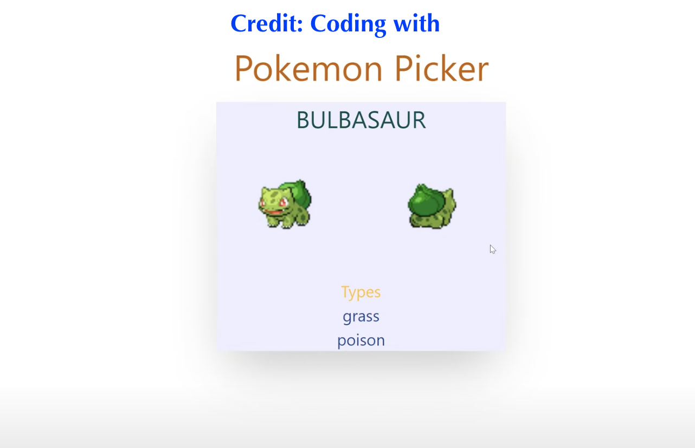

# Learn Vue.js 3.0 With Tailwind CSS And Composition API in 2021 - Create A Pokémon app For Beginners
## Credit: Erik Hanchett
1. [video tutorial ](https://www.youtube.com/channel/UCshZ3rdoCLjDYuTR_RBubzw)

2. [repo ](https://github.com/ErikCH/PokemonVue.git)

###### ```                           Screengrab =>```<br>



## Project setup
```
npm install
```

### Compiles and hot-reloads for development
```
npm run serve
```

### Compiles and minifies for production
```
npm run build
```

### Lints and fixes files
```
npm run lint
```

### Customize configuration
See [Configuration Reference](https://cli.vuejs.org/config/).
